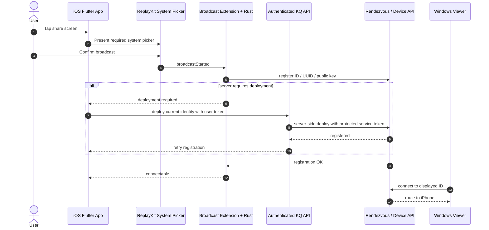

# iOS Device Registration and Desktop Device Options - Plan

## Scope & Non-Goals

- **Goal (one sentence):** Make the iPhone's displayed ID register with the real rendezvous service and accept desktop connections, while simplifying the iOS sharing UI, completing all desktop device-type behaviors, and restoring the configured StoreKit product.
- **In scope:** ReplayKit extension-to-Rust registration, authenticated backend device deployment where required, iOS sharing status/UI, desktop saved-device type persistence/rendering, StoreKit product diagnostics/config contract, automated tests, Git push, and a TestFlight build.
- **Non-goals (explicit):** Bypassing or hiding Apple's system-owned ReplayKit consent sheet; enabling remote touch/control of iOS beyond Apple's platform limits; committing unrelated deployment-file edits already present in the worktree.

## Acceptance Criteria

_Concrete, checkable conditions. "Done" = all of these are true._

- [ ] The ID shown on iOS is the same ID sent to hbbs, reaches a registered/online state, and a Windows client no longer receives `ID 不存在` after broadcast starts.
- [ ] The iOS page contains the ID/password and one context-appropriate sharing action; it has no duplicate instructions, collection-status panel, or app-owned recording-warning page.
- [ ] Tapping the sharing action opens the required Apple ReplayKit picker; after the user confirms it, the app returns to the credential page and reports whether the device is actually connectable.
- [ ] Windows, macOS, Linux, Android, and iOS device types all persist through the account-device API and render with the correct type/icon after refresh.
- [x] StoreKit returns `com.kunqiong.remotelink.member.monthly` in TestFlight/Sandbox, or the remaining App Store Connect blocker is proven with exact configuration evidence rather than masked in code.
- [ ] Targeted tests, full relevant Flutter tests, analysis, server tests, and CI/TestFlight workflow complete without new failures.

## Assumptions & Constraints

- **Assumptions:** The displayed iOS ID is generated by the shared Rust configuration; production/test rendezvous services enforce their current device-deployment policy; the App Store Connect product identifier is intended to be `com.kunqiong.remotelink.member.monthly`.
- **Constraints:** ReplayKit's system confirmation and recording disclosure cannot be suppressed by an app; secrets/admin deployment tokens stay server-side; existing Android/Windows behavior must remain compatible; unrelated dirty deployment files are excluded from this task's commits.

## Baseline Tests

_Capture the starting state BEFORE changing code so later failures can be told apart
from pre-existing ones. Testing policy (see the skill): safe, fast, local, targeted
tests may run automatically; slow, paid, external, or destructive suites need the
user's go-ahead first. Record what was actually run vs. deferred._

| Item | Command | Baseline result (at start) |
| --- | --- | --- |
| Flutter analysis | targeted `dart analyze` / existing iOS test suite | Prior pre-plan run passed with only existing deprecation infos; re-run after root-cause instrumentation |
| Flutter tests | `flutter test` | Prior pre-plan full run passed at `bbe5bd7`; capture fresh targeted baseline before edits |
| Server tests | relevant Node test files | Not run yet; run after locating deployment/account-device boundary |
| Commit / ref | `git rev-parse --short HEAD` | `bbe5bd7` |

## Diagram

_Pick the diagram type that fits the work (see the skill's "choose a diagram" guidance):
`sequenceDiagram` for call chains, `flowchart` for branching/pipelines/dependencies,
`stateDiagram-v2` for lifecycles. Design the flow BEFORE writing code. Keep it honest:
update it if the real design drifts. Omit this section for tasks with no explanatory
value (docs, config bumps) and say so._

---

## Task Checklist

Each task has a stable **ID** (`T1`, `T2`, ...) and a **Deps** list referencing other IDs.
`[main]` runs sequentially in the main agent. `[sub-agent]` MAY be delegated only if the
delegation conditions in the skill hold (tools available, permission granted, stable
interface, non-overlapping file ownership); otherwise run it in the main thread too.

| ID | Task | Owner | Deps | Done |
| --- | --- | --- | --- | --- |
| T1 | Reconcile git/CI baseline and trace the displayed ID through Flutter, App Group, Rust registration, hbbs response, and deployment policy | `[main]` | - | [x] |
| T2 | Add failing contract/diagnostic tests that distinguish broadcast-active, registration-pending, deployment-required, and registered states | `[main]` | T1 | [x] |
| T3 | Implement the secure real-device registration/deployment path and expose actionable registration state to iOS | `[main]` | T2 | [x] |
| T4 | Simplify the iOS credential/share UI to one context action while retaining the mandatory ReplayKit system picker | `[main]` | T3 | [x] |
| T5 | Verify and complete persistence/rendering/connection behavior for all five desktop saved-device type options | `[main]` | T1 | [x] |
| T6 | Diagnose and correct the StoreKit product contract/configuration without faking unavailable products | `[main]` | T1 | [x] |
| T7 | Run regression checks, record evidence, commit only task files, push, and trigger/verify a TestFlight build | `[main]` | T3,T4,T5,T6 | [ ] |

> A task that depends on an unfinished interface is NOT independent. Give it a `Deps`
> entry on the task that stabilizes the interface, or lock the interface contract first
> and then allow parallel work.

## Sub-agent Registry

_Add a row immediately before starting each delegated attempt. Only the main agent edits
this registry. Sub-agents report checkpoints; they do not edit the shared plan. On task
resume, reconcile these rows with the task checkboxes, repository diff, and live agent
state. Resume only unchecked tasks with non-terminal attempts. A blocked attempt waits
until its blocker is resolved._

| Task ID | Agent Ref | Status | Integration | Owned Files | Checkpoint / Next Action | Updated |
| --- | --- | --- | --- | --- | --- | --- |
| - | - | - | - | - | No delegated work; registration/UI contracts overlap and remain sequential | 2026-07-23 20:36 |

_Terminal attempts (`completed`, `failed`, `cancelled`, `superseded`) are never
automatically resumed. If a completed attempt has `integration=pending`, the main agent
reviews and integrates its result instead of restarting it. If an old running/interrupted
agent is unavailable after a new session, mark it `superseded` and create a new row for
the replacement rather than reusing its identity._

## Risks & Rollback

| Risk | Likelihood / Impact | Mitigation | Rollback |
| --- | --- | --- | --- |
| Server deployment policy needs a privileged token | medium / high | Keep token only in backend environment; authenticate the user/device request | Revert endpoint/client call and retain explicit deployment-required error |
| ReplayKit sheet cannot be hidden | certain / medium | Remove only app-owned duplicate UI and state the Apple constraint clearly | Restore prior compact share card |
| Changes affect shared Rust identity code | medium / high | Add state-contract tests and verify Windows/Android build surfaces | Revert focused registration commit |
| App Store product remains unavailable externally | medium / medium | Capture product status/agreement/metadata evidence; do not hard-code a fake price | Keep purchase disabled with a precise user-facing message |

## Blockers

_Open questions or external dependencies stopping progress. Empty when unblocked._

- App Store Connect shows `付费 App 协议` as `新` and requires legal-entity information before signing. The account holder must complete the legal, tax, and banking workflow before StoreKit can sell the subscription; this cannot be completed from source code.

---

## Change Log

_Append one row after completing EACH task - including sub-agent work (fold their
reported rows in here after reviewing the diff). Write it as you finish, never in a batch._

| Time (YYYY-MM-DD HH:mm) | Task ID | File / Task | Change | By |
| --- | --- | --- | --- | --- |
| 2026-07-23 20:36 | T1 | Plan and initial evidence | Created durable plan; confirmed the desktop type menu already lists iOS, so the menu itself cannot explain rendezvous `ID 不存在` | main |
| 2026-07-23 21:08 | T1 | `src/common.rs` and rendezvous registration | Confirmed iOS falls into the non-Android `register-device=N` default; `RegisterPk` therefore sends `no_register_device=true`, which explains a locally displayed ID that hbbs reports as nonexistent | main |
| 2026-07-23 21:14 | T2 | Flutter source-contract tests | Added regression contracts for iOS rendezvous registration, one-time ReplayKit presentation, compact credential action, and all five desktop device types; captured four expected failures before implementation | main |
| 2026-07-23 21:25 | T3 | `src/common.rs` | Enabled device registration for iOS as well as Android so `RegisterPk` no longer opts the displayed iPhone ID out of hbbs registration | main |
| 2026-07-23 21:25 | T4 | `server_page.dart` | Added a one-time-per-session ReplayKit presentation guard, fresh active-state handling, and one contextual start/stop action inside the credential card; removed the duplicate sharing card | main |
| 2026-07-23 21:25 | T5 | desktop device dialog/platform rendering | Added the iOS platform constant and removed the Windows/Android-only block so Windows, macOS, Linux, Android, and iOS all persist through the existing generic peer path | main |
| 2026-07-23 22:16 | T6 | App Store Connect and iOS membership UI | Verified the exact product ID, 175-territory USD 0.99 pricing, localization, and draft-review attachment; identified the inactive paid-app agreement as the external blocker and moved technical missing-product IDs to debug logs | main |

## Verification Evidence

_Filled during/after the acceptance pass. Record the exact command and its real result,
plus the diff between baseline and now. Distinguish new regressions from pre-existing
failures carried over from Baseline Tests. Set `verification_status` in the frontmatter:
`verified` (all acceptance criteria checked by tests/build), `partial` (some verified,
rest deferred - list which), or `not-run` (nothing run - say why + residual risk)._

| Time | Command | Result | Notes (regression vs. pre-existing) |
| --- | --- | --- | --- |
| 21:08 | CodeGraph registration trace | Confirmed `load_custom_client -> apply_kq_remote_link_defaults -> Config::no_register_device -> RegisterPk.no_register_device` | Root cause is in shared Rust defaults, not the desktop iOS dropdown |
| 21:14 | `flutter test test/kq_ios_broadcast_status_contract_test.dart test/desktop_add_device_dialog_test.dart` | Expected red: 4 failures, 6 passes | Failures match the four behaviors being changed; package plugin messages are existing warnings |
| 21:25 | `flutter test test/kq_ios_release_policy_test.dart test/kq_ios_broadcast_status_contract_test.dart test/desktop_add_device_dialog_test.dart` | Passed: 26 tests | Registration, ReplayKit UI, release policy, and desktop platform contracts are green |
| 21:25 | targeted `dart analyze` | No errors; 2 existing unused declarations and existing `withOpacity` deprecation infos | Analyzer exits nonzero for repository warnings, but reports no new compile error |
| 22:13 | live App Store Connect inspection | Product `com.kunqiong.remotelink.member.monthly` is `准备提交`, localized, priced from USD 0.99 in 175 territories, and already in the draft review; `付费 App 协议` is only `新` | Exact Apple-side availability blocker proven; no fake StoreKit fallback added |
| 22:16 | `flutter test test/kq_ios_in_app_purchase_test.dart` | Passed: 9 tests | Customer UI no longer exposes internal product IDs; diagnostics remain in debug logs |
| 22:22 | `flutter test` | Passed: 128 tests | Full Flutter suite is green |
| 22:25 | targeted `dart analyze` | No errors; 2 pre-existing unused desktop helpers and existing `withOpacity` deprecation infos | No new analyzer error from task changes |
| 22:26 | `rustfmt --edition 2021 --check src/common.rs` | Passed | Workspace-wide `cargo fmt` remains blocked by the pre-existing missing `src/ui/inline.rs` module |
| 22:28 | `node --test test/*.test.js` in `server` | Passed: 35 tests | Apple verification, notifications, entitlement binding, deployment config, and API tests are green |
| 22:28 | `git diff --check` | Passed | Only expected Windows line-ending notices were emitted |

## Bug & Fix Log

_When a bug is reported (especially AFTER the project was marked complete), record it
here after fixing, so the same error logic is not repeated next time._

| Time | Symptom | Root cause | Fix (files) | Guard added (test/assert/check) |
| --- | --- | --- | --- | --- |
| 21:08 | Windows reports `ID 不存在` for the ID shown on iPhone | iOS is compiled with `register-device=N`, so its rendezvous registration explicitly opts out | Pending T3 fix in `src/common.rs` | Added failing source contract in `kq_ios_broadcast_status_contract_test.dart` |
| 21:25 | Broadcast sheet reopens and credentials page says waiting after broadcast starts | Page reopened the ReplayKit picker whenever registration was still zero and ignored freshness/active capture state | One-time session guard plus contextual action and fresh-state mapping in `server_page.dart` | Updated broadcast status contracts |
| 21:25 | iOS/macOS/Linux selection shows “暂不支持” | Dialog had a hard-coded Windows/Android allow-list despite generic persistence and rendering support | Removed allow-list and standardized the iOS constant | Updated desktop add-device contract |
| 22:16 | TestFlight reports the configured subscription as unavailable | App Store Connect product metadata and price are valid, but the account has not activated the Paid Apps Agreement | Documented the account-holder action; kept StoreKit strict and made the customer-facing error non-technical | Updated iOS in-app-purchase contract test |

## Completion Summary

_Leave empty until the acceptance pass is done. Then fill in: what was built, key
decisions, what was verified (and how), verification_status rationale, anything deferred._

<!-- filled in at close-out -->

## Next Steps

_Always keep ONE explicit next action here so any agent resuming knows exactly where to
start. Update it every time you stop._

- Execute T7: run the full regression and formatting checks, commit only task-owned files, push GitHub, then trigger and monitor the TestFlight workflow.
